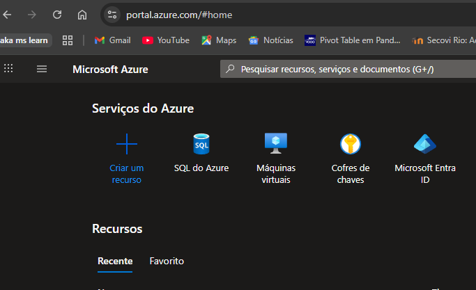
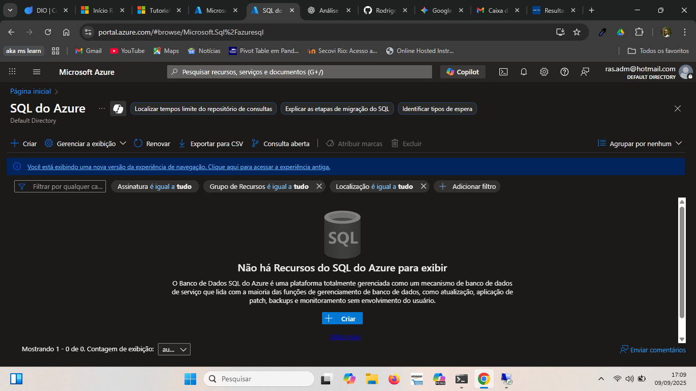
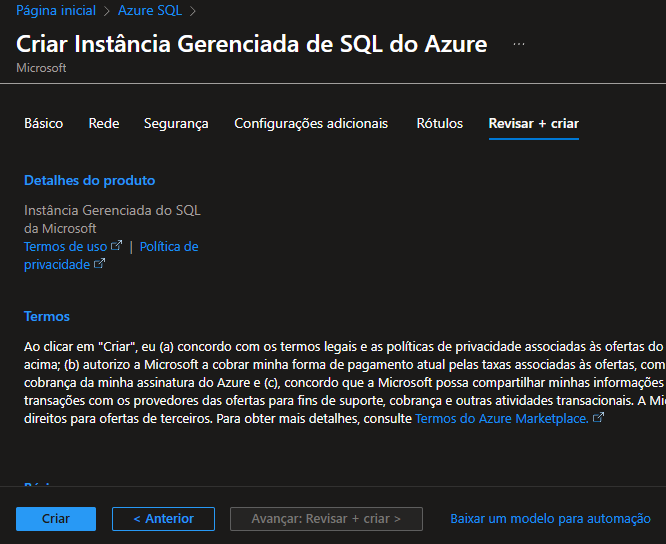

# Desafio 3 - Microsoft Azure SQL 

Repositório com anotações, resumos e imagens do Desafio 3 do Bootcamp Microsoft-azure-az-900.

## 📌 Objetivo
Praticar a criação e configuração de uma instância de **Banco de Dados SQL** no **Microsoft Azure** e documentar o passo a passo para futuras referências.

---

## 🚀 Passo a Passo Realizado

### 1️⃣ Criar a instância SQL no Azure
- Acesse o [Portal Azure](https://portal.azure.com/).
- Clique em **Criar um recurso** → **Banco de dados SQL**.
- Configure os seguintes campos:
  - Nome da instância: `diosqlaz900`
  - Nome do banco de dados: `dbaz900desafio003`
  - Região: *a escolhida por você*
  - Camada de serviço: **Uso Geral**
- Clique em **Revisar e Criar**.

---

### 2️⃣ Configurações de segurança
- Autenticação configurada via **Microsoft Entra ID**.
- Backup automático configurado para **7 dias**.

---

### 3️⃣ Imagens do processo





---

## 🧠 Dicas e Observações
- Utilize o **Quickstart da Microsoft** para revisar os comandos:  
  [Documentação oficial](https://learn.microsoft.com/pt-br/azure/virtual-machines/windows/quick-create-portal?source=docs)
- Sempre organize os recursos no Azure em **grupos de recursos**.
- Faça snapshots periódicos para segurança dos dados.

---

## 📂 Estrutura do Repositório
```bash
desafio-03-azure-sql/
│── README.md          # Documentação do desafio
│── imagens/           # Prints do passo a passo


✍️ Autor

Rodrigo – Analista de Dados
Bootcamp: microsoft-azure-az-900

